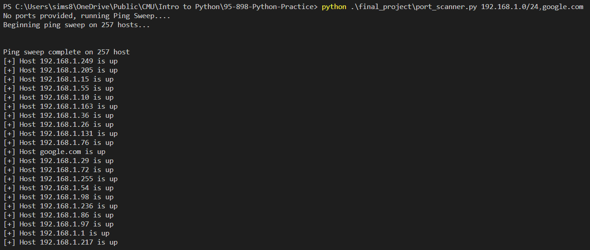
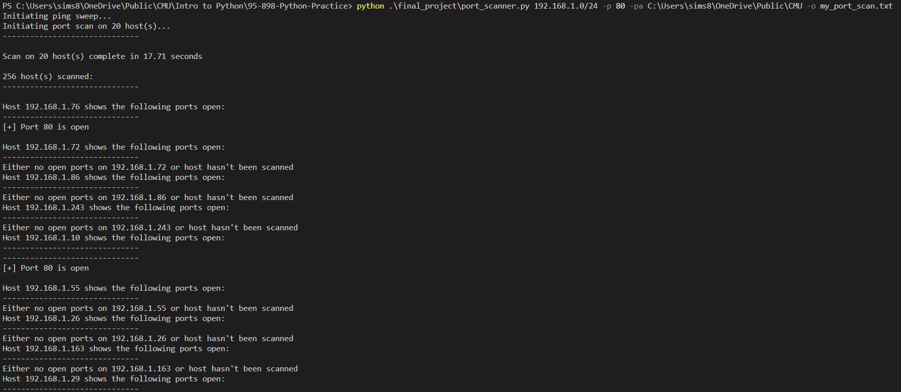
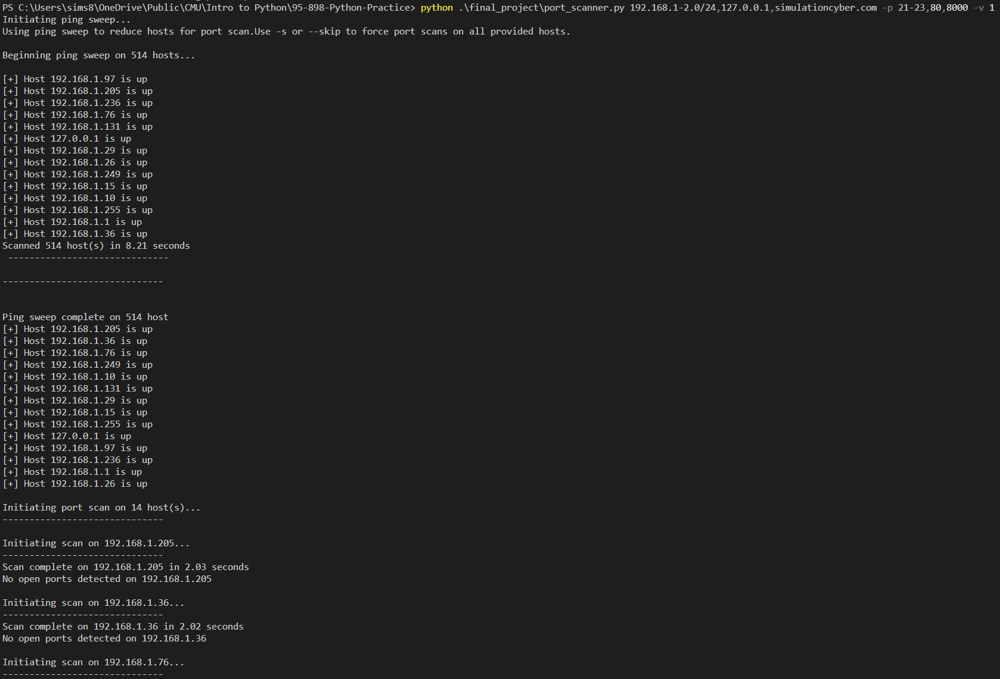
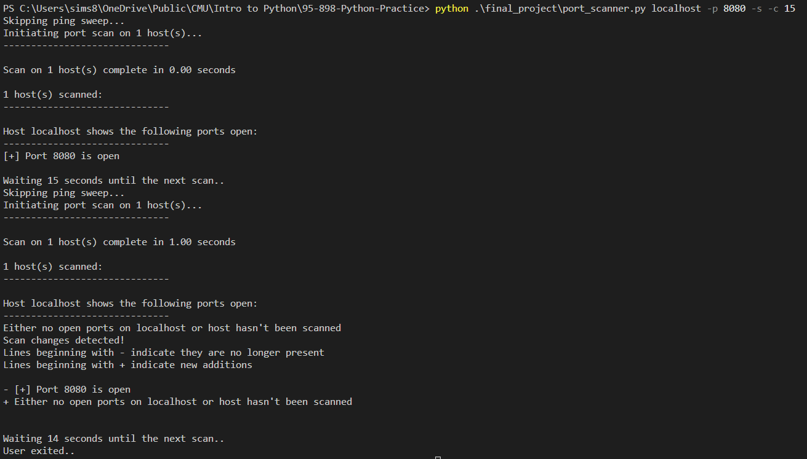

# Python Port Scanner

- Goals: The goal of this program is to conduct ping scans to check whether hosts are alive, and TCP scans to check whether specific ports are open on hosts. 

- Design: This program consists of a main function, and 4 supporting classes. The first is the "Network" class which is designed to manage attributes for the concept of a network, including ping sweeps, and creating host objects for each host within the network. The Host class similarly maintains information about a singular host. Within each of these classes there is a multithreaded scan, for network it is a ping sweep, and for host it is a port scan. They each make use of the scan_threader class which takes either a user provided flag and value (-n <int>) to determine the number of threads, or calculates it by taking the amount of targets to be scanned and dividing by 2. Back into main, the final supporting class is the file manager which simplifies writing the scans to a file, and comparing/reporting changes when continuous scanning is used.

- Usage: The default behavior with a port scan is to first conduct a ping scan so that port scans aren't being conducted on hosts that are not alive. Various arguments exist to slightly modify various behaviors, including the output folder and filename, timeout for port scans, verbosity of the terminal output (doesn't affect file output), the number of threads to create for the scans (the default is to take the # of targets and divide by 2), the -s or --skip option for skipping the ping sweep preceeding the port scan and force the scan on all provided hosts, and finally an option to conduct the scan continuously, given N number of seconds, and report whether or not there were any changes in the scan results. The host(s) and port(s) parse a variety of user inputs including comma separated, ranges (i.e. 192.168.1.1-10, or 192.168.1-10.5), and CIDR notation, or any combination therein. Additionally, ports can be supplied as comma separated, ranges, or a combination. The parsing of these inputs works using recursion by looking for the various indicators (dash, comma, backslash), splitting up the input, and then passing that split again through the function before the final result is fed all the way back up to the original call to the function.

- Demo: A few examples of scans with screenshots are below, please note several of these scan outputs are very long and have been cropped for brevity...

    - [ Conduct ping sweep on network 192.168.1.0/24 and google.com ]
    - port_scanner.py 192.168.1.0/24,google.com
    - 

    - [ Check port 80 on hosts in network 192.168.1.0/24 with unique directory/filename ]
    - port_scanner.py 192.168.1.0/24 -p 80 -pa /home/user/Desktop -o my_port_scan.txt
    - 

    - [ Check ports on list of hosts and increase verbosity of output ]
    - port_scanner.py 192.168.1-2.0/24,127.0.0.1,mydomain.com -p 21-23,80,8000 -v 1
    - 

    - [ Conduct continuous scans (every N seconds) on a specific host and skip initial ping sweep ]
    - port_scanner.py localhost -p 8080 -s -c 15
    - 